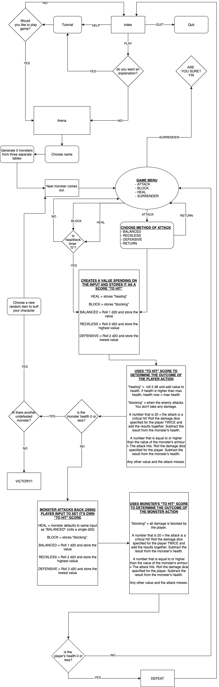

<h1>AidanKirvan_T1A3</h1>
<h6>Terminal app assignment for coder academy</h6>

## PURPOSE AND SCOPE

This is a quick turn-based fighting game that emulates the combat elements of **Tabletop Roleplaying Games (TRPGs)**. It pitts the user up against random enemies in up to three consecutive rounds, each with an increasing difficulty. To win the game the user needs to win the third round. Game rules and logic are loosely based off of **5th edition Dungeons and Dragons** rules.
The application uses an emulation of **dice rolls** and **modifiers** for every attack attempt and damage on a hit. It allows the user options to manipulate their odds and remember enemy attack patterns to avoid large amounts of damage and reach the end of the game.
It offers the user items or power-ups to encourage the user to make decisions that could affect the outcome of the next round.
Dice rolls are managed through ranomised arrays. Encounters are organised and randmoised through a similar function.
Abilities that heal, avoid damage or dictate when an enemy uses it's more powerful attack are managed through variables that keep count.

The app is designed to create an entertaining and addictive experience for the user. The randomised aspect makes fights unpredicatble and intense while options in and out of combat give the user a sense of control over the game.

The target audience is for people who enjoy tabletop roleplaying games, video-game roleplaying games, and high-fantasy concepts. It's for people who want a quick gaming experience and not a long-term investment.

Utilisation of the project is achieved through the use of **gems** that substitute alphabetical or numerical input for highlighted prompts that can be navigated with **arrow keys** and selected with the **space bar** or **enter**.

<!--
- DESCRIBE at a high level what the application can do

- IDENTIFY the problem it will solve and explain why you are developing it

- IDENTIFY the target audience

- EXPLAIN how a member of the target audience will use it
-->

---

## FEATURES

MVPS
- **DICE ROLLS:** Dungeons & Dragons uses a variety of polyhedral dice with varying shapes and values. These are referred to with a 'D' followed by the number of sides on the dice (eg, D4, D6, D20, D100 etc...).
In order to emulate these dice, an array is made for each dice weighting and contains one index containing a range from **1** to the number of sides the dice has.
eg.
`D6 = [1..6]`
`D8 = [1..8]`
`D10 = [1..10]`
In order to roll the dice. A method called "roll" takes the name of the array, accesses index 0 of the array, randomly determines a number within the range specified and then returns that number.
eg.

        D20 = [1..20]

        roll(dice)
            score = dice[0]
            return score
        end

        puts roll(D20)

- **CERTAIN MECHANICS FROM DND 5e:**
**An Explanation of the Concepts:**
The first thing to address here is the core flow of combat in D&D5e. In simpler terms, the player characters and enemies take turns to use their movement, an action and a bonus action. Player characters are controlled individually by each player, while the enemy encounters are controlled by the Dungeon Master who runs the game. For this project I am ignoring movement and bonus actions.
*The key components for making an attack are:*
    - Rolling a 20 to see if you hit your target
    - adding **modifiers** to increase your odds
    - comparing the total score against a targets **armour class** (AC).
    - if the outcome is a successful hit, you then roll additional dice to determine how much damage you have done.

    *For 5th edition D&D, an attack action in a tun would look like this:*
    1) Attacker rolls a D20 to hit the monster.
    1) The Attacker then adds modifiers to the roll depending on their stats and whether they are proficient in the weapon they are using.
    1) If the total value of the roll plus the modifiers is equal or higher than their armour class, the attack hits. Otherwise it misses.
    1) On a hit, the attacker then rolls the type/amount of dice specified by the weapon and add appropriate modifiers based on their statistics.

    *The key elements this project will focus on are:*
    - rolling a value to hit
    - comparing that value against a specified armour class
    - and rolling a value for damage if the attack does hit
    - Additional combat features such as the **advantage** and **disadvantage** system and the **critical hit** system.

    **Advantage and Disadvantage:**
    Past editions of Dungeons & Dragons differ in many ways. In particular relation to this application, combat was a lot more complicated and relied on tables of modifiers to determine the advantages and disadvantages a player might have with their character (eg. attacking an unaware enemy might make it easier for you to hit and allow the damage you cause to be a higher numerical value. While being drunk would mean subtracting a given amount from your total scores to hit your enemy and the damage dealt). 5th edition D&D however opts for an advantage and disadvantage system.
    This works by rolling two die and using the highest score for advantage, and using the lowest score for disadvantage. Another method can be used to specify this.

        advantage(dice)
            score1 = dice[0]
            score2 = dice[0]
            if score1 >= score2
                return score1
            else
                return score2
            end
        end

        disadvantage(dice)
            score1 = dice[0]
            score2 = dice[0]
            if score1 >= score2
                return score2
            else
                return score1
            end
        end
    A way that I had decided to implement this feature was based off of a game feature called "reckless attack". The idea is that you can attack an enemy with advantage so that you are more likely to hit them, except that because you are attacking recklessly, all attacks until your next turn also have advantage on you.
    To translate this feature into the application, an attack action leads to a sub-menu that offers three methods off attacking:
    >***RECKLESS:*** *You attack aggressively. When you roll to hit your enemy, you roll two die and use the highest score. Because you are attacking recklessly, your foe attempts to hit you back in the same way.*
    >***DEFENSIVE:*** *You are being cautious. As such it is harder to hit your foe. You roll two die to hit your enemy and use the lowest score. But because you are being cautious, your foe has trouble hitting you back and suffers the same effect.*
    >***BALANCED:*** *This is a normal attack. You roll one dice to hit and so does your enemy.*
    
    The idea here being that you can rush a weak enemy with a reckless attack or opt for a cautious approach if your enemy has you on the ropes (should the user wish to). All in all it'd be more fun that rolling straight rolls and hoping for the best.
    Another major aspect of TRPGs that I wanted to implement.

    **Critical Hit:**
    This system is easier to explain. Simply if the attack roll results in a **20** (the highest value on the dice), the attack is considered to be a **critical hit**. The result of this meaning that when you roll for damage, you roll twice the amount of dice (eg. if it's a spell attack that cause 6 d6 of damage, you would instead roll 12 d6 on a critical hit).
    This is achieved through the following:

        CRITICAL_HIT = 20

        if hit_score == CRITICAL_HIT
            turn_damage = (player_damage(D8) + player_damage(D8))
        elsif hit_score >= mon_armour_class
            turn_damage = player_damage(D8) + 2
        else
            puts "You miss!"
        end

- **RANDOMISED ENCOUNTERS:** To keep things exciting, a variety of monsters will be grouped into three tiers

SHALL I DO DIFFERENT PAGES OR CLASSES??

- **CLEAN COMBAT INTERFACE:**
USE TTY
- **VISIBLE HEALTH SCORES FOR THE USER AND THE ENEMY:**
USE system('clear') and tty
- **A RANDOMISED SLECTION OF ITEMS:**
array? Module?
<!--
Must list and describe at least THREE features

Show an understanding of
- variables and the use of variable scope
- loops and conditional control structures
- error handling
-->
NICE TO HAVES
- **HALL OF FAME FOR PEOPLE WHO CLEAR THE GAME:**

---

## OUTLINE

<!--
Outline of user interaction and experience.
Musing include:
- how the user will find out how to interact with and use each feature
- how the user will interact with each feature
- how errors will be handled by application and displayed to the user
-->

---

## DIAGRAM

<!-- Flow control diagram
- must show logic/workflow and/or the integration of the features in your application for each feature
- utilise a recognised format or set of conventions for a control flow diagram such as UML -->

---

## IMPLEMENTATION PLAN

<!-- 
USE TRELLO
- how each feature will be implemented and a checklist of tasks for each feature
- prioritise the implementation of different features or checklist items within a feature
- provide a deadline, duration or other time indicator for each feature or checklist/checklist item

Utilise a suitable project management platform to track this implementation plan

your checklists should have at least 5 items for each feature -->

---

## HELP DOCUMENTATION

- how to install
- dependencies required by the application
- system and hardware requirements