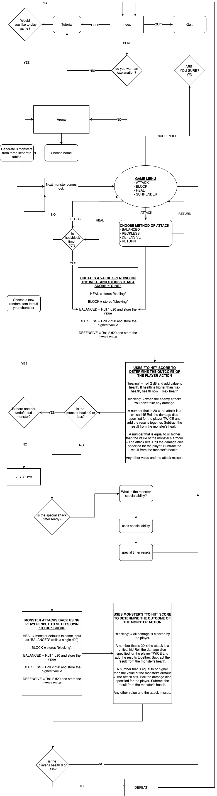

<h1>FIGHT MONSTERS OR WHATEVER</h1>
<h6>Terminal app assignment for coder academy</h6>

## PURPOSE AND SCOPE

This is a quick turn-based fighting game that emulates the combat elements of **Tabletop Roleplaying Games (TRPGs)**. It pitts the user up against random enemies in up to three consecutive rounds, each with an increasing difficulty. To win the game the user needs to win the third round. Game rules and logic are loosely based off of **5th edition Dungeons and Dragons** rules.
The application uses an emulation of **dice rolls** and **modifiers** for every attack attempt and damage on a hit. It allows the user options to manipulate their odds and remember enemy attack patterns to avoid large amounts of damage and reach the end of the game.
It offers the user items or power-ups to encourage the user to make decisions that could affect the outcome of the next round.
Dice rolls are managed through ranomised arrays. Encounters are organised and randmoised through a similar function.
Abilities that heal, avoid damage or dictate when an enemy uses it's more powerful attack are managed through variables that keep count.

The app is designed to create an entertaining and addictive experience for the user. The randomised aspect makes fights unpredicatble and intense while options in and out of combat give the user a sense of control over the game.

The target audience is for people who enjoy tabletop roleplaying games, video-game roleplaying games, and high-fantasy concepts. It's for people who want a quick gaming experience and not a long-term investment.

Utilisation of the project is achieved through the use of **gems** that substitute alphabetical or numerical input for highlighted prompts that can be navigated with **arrow keys** and selected with the **space bar** or **enter**.

<!--
- DESCRIBE at a high level what the application can do

- IDENTIFY the problem it will solve and explain why you are developing it

- IDENTIFY the target audience

- EXPLAIN how a member of the target audience will use it
-->

---

## FEATURES

#### MVPS
- **DICE ROLLS:** Dungeons & Dragons uses a variety of polyhedral dice with varying shapes and values. These are referred to with a 'D' followed by the number of sides on the dice (eg, D4, D6, D20, D100 etc...).
In order to emulate these dice, an array is made for each dice weighting and contains one index containing a range from **1** to the number of sides the dice has.
eg.
`D6 = [1..6]`
`D8 = [1..8]`
`D10 = [1..10]`
In order to roll the dice. A method called "roll" takes the name of the array, accesses index 0 of the array, randomly determines a number within the range specified and then returns that number.
eg.

        D20 = [1..20]

        roll(dice)
            score = dice[0]
            return score
        end

        puts roll(D20)

- **SELECT MECHANICS FROM DND 5e:**
**An Explanation of the Concepts:**
The first thing to address here is the core flow of combat in D&D5e. In simpler terms, the player characters and enemies take turns to use their movement, an action and a bonus action. Player characters are controlled individually by each player, while the enemy encounters are controlled by the Dungeon Master who runs the game. For this project I am ignoring movement and bonus actions.
*The key components for making an attack are:*
    - Rolling a 20 to see if you hit your target
    - adding **modifiers** to increase your odds
    - comparing the total score against a targets **armour class** (AC).
    - if the outcome is a successful hit, you then roll additional dice to determine how much damage you have done.

    *For 5th edition D&D, an attack action in a turn would look like this:*
    1) Attacker rolls a D20 to hit the monster.
    1) The Attacker then adds modifiers to the roll depending on their stats and whether they are proficient in the weapon they are using.
    1) If the total value of the roll plus the modifiers is equal or higher than their armour class, the attack hits. Otherwise it misses.
    1) On a hit, the attacker then rolls the type/amount of dice specified by the weapon and add appropriate modifiers based on their statistics.

    *The key elements this project will focus on are:*
    - rolling a value to hit
    - comparing that value against a specified armour class
    - and rolling a value for damage if the attack does hit
    - Additional combat features such as the **advantage** and **disadvantage** system and the **critical hit** system.

    **Advantage and Disadvantage:**
    Past editions of Dungeons & Dragons differ in many ways. In particular relation to this application, combat was a lot more complicated and relied on tables of modifiers to determine the advantages and disadvantages a player might have with their character (eg. attacking an unaware enemy might make it easier for you to hit and allow the damage you cause to be a higher numerical value. While being drunk would mean subtracting a given amount from your total scores to hit your enemy and the damage dealt). 5th edition D&D however opts for an advantage and disadvantage system.
    This works by rolling two die and using the highest score for advantage, and using the lowest score for disadvantage. Another method can be used to specify this.

        advantage(dice)
            score1 = dice[0]
            score2 = dice[0]
            if score1 >= score2
                return score1
            else
                return score2
            end
        end

        disadvantage(dice)
            score1 = dice[0]
            score2 = dice[0]
            if score1 >= score2
                return score2
            else
                return score1
            end
        end
    A way that I had decided to implement this feature was based off of a game feature called "reckless attack". The idea is that you can attack an enemy with advantage so that you are more likely to hit them, except that because you are attacking recklessly, all attacks until your next turn also have advantage on you.
    To translate this feature into the application, an attack action leads to a sub-menu that offers three methods off attacking:
    >***RECKLESS:*** *You attack aggressively. When you roll to hit your enemy, you roll two die and use the highest score. Because you are attacking recklessly, your foe attempts to hit you back in the same way.*
    >***DEFENSIVE:*** *You are being cautious. As such it is harder to hit your foe. You roll two die to hit your enemy and use the lowest score. But because you are being cautious, your foe has trouble hitting you back and suffers the same effect.*
    >***BALANCED:*** *This is a normal attack. You roll one dice to hit and so does your enemy.*
    
    The idea here being that you can rush a weak enemy with a reckless attack or opt for a cautious approach if your enemy has you on the ropes (should the user wish to). All in all it'd be more fun that rolling straight rolls and hoping for the best.
    Another major aspect of TRPGs that I wanted to implement.

    **Critical Hit:**
    This system is easier to explain. Simply if the attack roll results in a **20** (the highest value on the dice), the attack is considered to be a **critical hit**. The result of this meaning that when you roll for damage, you roll twice the amount of dice (eg. if it's a spell attack that cause 6 d6 of damage, you would instead roll 12 d6 on a critical hit).
    This is achieved through the following:

        CRITICAL_HIT = 20

        if hit_score == CRITICAL_HIT
            turn_damage = (player_damage(D8) + player_damage(D8))
        elsif hit_score >= mon_armour_class
            turn_damage = player_damage(D8) + 2
        else
            puts "You miss!"
        end

- **PLAYER STATS AND ABILITIES:** We need to determine when the user loses the game, how much health the user has, when the user is able to use abilities and other attributes that could be affected by items. To do this we group a number of values into a class called **Player**:

    - Maximum Health: Determines where the users health value starts and the maximum amount it can heal to.
    - Health: A value that can change depending on how much damage the user takes. When this reaches 0 or lower, the player loses.
    - Armour Class: The amount of armour the user has. The enemy needs to roll the value of the Player's armour class or higher for them to take damage.
    - Damage: The type of dice the player rolls when an attack hit's a monster.
    - Flask: For the sake of the game, this is a flask of potion that refills its self after it is used. It takes a number of turns for the flask to refill.
    This value changes when the heal action is used and it gradually ticks back down to **0** over each turn that passes. When the flask's value is equal to 0, it can be used again.
    - Shield: Has a similar function to the flask, only it aligns with the player's ability to block all incoming damage.

- **RANDOMISED ENCOUNTERS:** To keep things exciting, a variety of monsters will be grouped into three tiers:
    
    - *1st level monsters:* Easier monsters. capable of killing careless players but this stage is not too difficult.
    - *2st level monsters:* A bit harder. You'll have to learn patterns to get past these smoothly.
    - *3st level monsters:* Much harder. You will have to really pick and choose when to block and when to be defensive.

    Monster statistics are kept in a class called '"Enemy". They contain some stats similar to the player and others of their own.

    - Monster Name: Name of the monster so the program knows what it's calling and the user knows what they are up against.
    - Maximum Enemy Health: The maximum amount of health points the monster has.
    - Enemy Health: A second health variable is made that can be affected by damage and healing. 
    - Armour Class: The value that determines how hard the monster is to hit. A dice roll to hit the monster has to be equal to or higher than this number.
    - Damage: When a monster scores a hit on the player, this determines which value of dice the monster rolls.
    - Special attack name and a special attack cooldown: These two will be explained in the next point.

- **MONSTER SPECIAL ATTACKS:** In Dungeons and Dragons 5e, creature rules are referred to in "Stat blocks". These list the creatures statistics, abilities and attack patterns. Some enemies have more powerful moves than others, these can include breathing fire, healing themselves, shooting web or attacking multiple times.
    For the most part the Dungeon Master, who runs the game, determines when and how to use these abilities. But seeing as how the user is up against a scripted program, replicating these elements has to be tackled in a different manner...
    I called these attacks special attacks, as it's a universally recognised term with games. I could allow these attacks to trigger randomly, but that would remove a lot of the control from the player and leave their fate to chance. Instead, I figure creating varying patterns would mean the attack doesn't get used all the time, and the player could learn these patterns if they wanted to be better at playing the game.
    In order to manage this we add two features to the *Enemy* class:

    - Special attack *name*.
    - Special attack *cooldown*

    When the program ends the users turn, it checks if the monster's **@health** value is **0** or lower. If it is is **0** or lower, the next monster comes out, otherwise it will determine what the monster is going to do.
    First it checks the **speacial attack cooldown** to see if the number value is **0**. If the value is higher than **0** it initialises the monsters normal attack logic. Otherwise it checks the monster's **special attack name**.
    Depending on the name it will roll a certain number of a certain value of dice and return the result with flavour text. Then it will return the cooldown counter back to the **special attack counter** value listed in the monster's stats. 

- **VISIBLE HEALTH SCORES FOR THE USER AND THE ENEMY:** Using the *maximum health* and flexible *health* statistic for both the player and the randomised enemy, max health and current health will be displayed at the top of the screen every time the screen is cleared. This way players can keep and eye on their situation or results when they are in sub-menus or have won or lost.

<!--
Must list and describe at least THREE features

Show an understanding of
- variables and the use of variable scope
- loops and conditional control structures
- error handling
-->
#### NICE TO HAVES

- **RANDOMISED ITEMS:** An array of items that make changes to the player's stats for the rest of the game. No two items should be printed which will be tricky. As soon as an item is selected it would have to delete itself from the array.
- **END OF GAME SUMMARY:** A summary of damage dealt/taken, hits that hit or missed, total heals and blocks etc...
- **HALL OF FAME FOR PEOPLE WHO CLEAR THE GAME:** A system where people can enter their name into a hall of fame. A value would be next to that player's name to indicate how many times they've cleared the game.
- **ENDLESS MODE:** A mode where the player can continue to play for as long as they are able to stay alive.

---

## OUTLINE

On application launch users will first be introduced to a main page where they will be presented with a number of options.
These options are:
1. **Start Game**: *Begin the game*
2. **Dice**: *Manually play around with a dice rolling app*
3. **How to Play**: *An explanation on how to play the game*
4. **Quit**: *Manually exit the application*

Should the user need an explanation of the mechanics they can find it in **How to Play**, otherwise most of the features are displayed throughout the application (ie. dice rolls, health status, player actions, etc.).

Accessing particular functions of the application is done through *prompts* using 'TTY Prompts'. This allows the user to make quick decisions without having to type in any other input other than pressing **SPACE** or **RETURN**. One exception to this is the prompt to enter a name at the start of the game.

Error handing is handled primarily for the user name prompt, wherein a method is called upon.

<!--
Outline of user interaction and experience.
Musing include:
- how the user will find out how to interact with and use each feature
- how the user will interact with each feature
- how errors will be handled by application and displayed to the user
-->

---

## DIAGRAM

<!-- Flow control diagram
- must show logic/workflow and/or the integration of the features in your application for each feature
- utilise a recognised format or set of conventions for a control flow diagram such as UML -->

---

## IMPLEMENTATION PLAN
The following is a list of features prioritised in order of completion. Within each list is a sub-list that is broken up into *MVP* tasks and *SPRINKLES*. *MVP* tasks at the top of the list need to be completed before the next feature in the main list can be worked on. Any *SPRINKLES* can be returned to at a later date.

1. **DICE ROLLS**
    MVP

    1. Arrays for each weight of die so that a number can be called.
    2. Methods that can call on a radom vale in any given dice array.
    3. Advantage and Disadvantage methods so that two dice can be rolled and the highest or lowest value is used.
    4. Test that methods are working as needed.

    SPRINKLES

    1. Add a dice rolling app to the main menu.
    2. Transform dice arrays into one hash. `{:die_name => 0..[die_weight]}`

1. **PLAYER/ENEMY**
    MVP

    1. Player and Enemy class with stats (Health, max health, armour, player damage, etc...)
    2. Player name prompt
    3. healing and blocking function
    4. Methods to call upon player damage/healing/etc.

    SPRINKLES

    1. Healing and blocking cooldown
    2. Print player health and item status
    3. Special attack cooldown methods
    
1. **RANDOMISED ENCOUNTERS**
    MVP

    1. Make thee monster arrays with a hash per monster containing it's stats
    2. Method that randomly selects a monster from each array and stores it into separate methods
    3. Add logic of storing first monster in a standard monster value, then overwriting it with the next monster when that monster's health reaches 0.

    SPRINKLES

    1. Add more monsters to arrays
    2. Add special attacks (multi, breath, restrain)
    3. Add crit system to multi-attacks
    4. Add advantage and disadvantage system to special attacks
    
1. **COMBAT/INTERFACE/GAME LOGIC**
    MVP

    1. Player turn then monster turn in a loop
    2. crit system
    3. advantage system
    4. logic for healing and blocking
    5. monster attack logic based on user input
    6. Display current monster health, player health and cooldown status for healing and blocking.
    7. Victory and defeat conditions

    SPRINKLES

    1. special attack logic
    2. loading for different pages on defeat, victory or surrender.
    

<!-- 
USE TRELLO
- how each feature will be implemented and a checklist of tasks for each feature
- prioritise the implementation of different features or checklist items within a feature
- provide a deadline, duration or other time indicator for each feature or checklist/checklist item

Utilise a suitable project management platform to track this implementation plan

your checklists should have at least 5 items for each feature -->

---

## HELP DOCUMENTATION
#### Requirements
- MacOS or Linux
- Windows users will have to install [WSL](https://docs.microsoft.com/en-us/windows/wsl/install-win10)
- [Ruby 2.7.2](https://www.ruby-lang.org/en/)
- It is reccomended to play *Fight Monsters or Whatever* with your terminal in fullscreen mode or with the window at fullscreen width and height.

#### How to Install
1. **DOWNLOAD**
You can download or clone the repository [here](https://github.com/teraglin/Fight-Monsters-or-Whatever).
 If you are unsure how to clone the repository you can download the zip file by clicking the green **Code** button and selecting **Download ZIP**. From there you can unzip the file in your desired location

2. **LOCATE FOLDER IN YOUR TERMINAL**
You will need to open your terminal and locate the *src* folder in the *Fight-Monsters-or-Whatever* folder. If you are unsure how to do this, save the folder on your desktop and copy and paste
`cd ./desktop/Fight-Monsters-or-Whatever/src`
into your terminal and press return.
3. **INSTALL**
When you are in the src folder in *Fight-Monsters-or-Whatever* on your terminal. You will need to install the application by entering:
`bash fmow_install.sh` if you are using Bash
or
`zsh fmow_install.sh` if you are using Zshell (Zsh)
You can check what shell your terminal uses by running
`echo "$SHELL"` in your terminal.
4. **RUN**
Once installation is done, the game will run. If you wish to run the program again, you can skip the installation process and run
`bash fmow.sh` for bash
or
`zsh fmow.sh` for zsh

If you have any questions, you can contact me via pm through my [twitter](https://twitter.com/kakaposaur).
